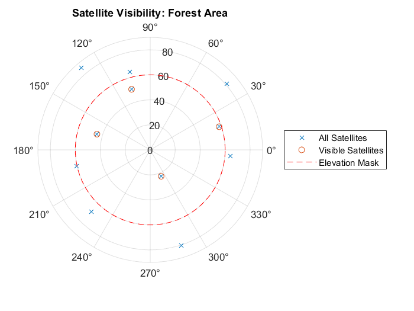
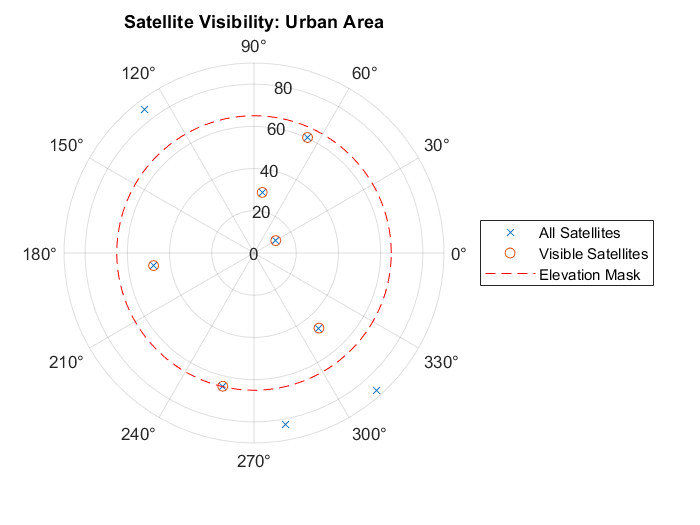
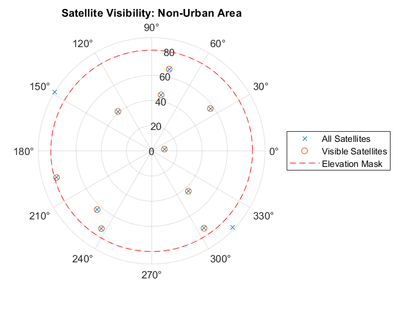
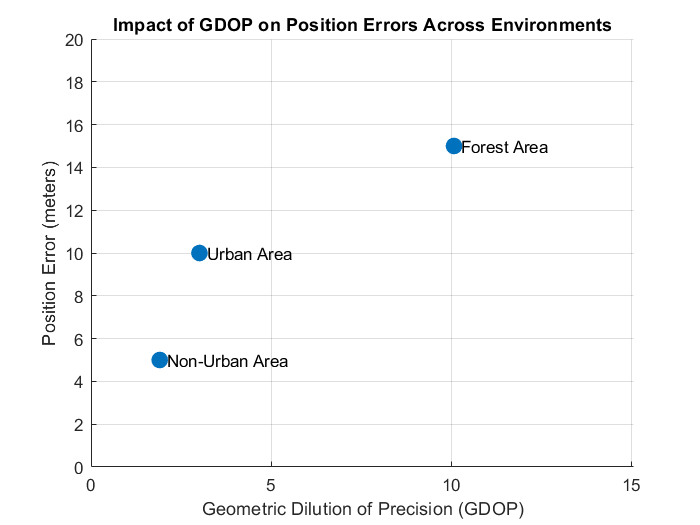

# GPS Satellite Visibility & GDOP Analysis

MATLAB-based project for analyzing GPS satellite visibility and evaluating the impact of Geometric Dilution of Precision (GDOP) on positioning accuracy under different environmental conditions.

---

## Overview

The accuracy of GPS positioning depends not only on the number of visible satellites but also on their geometric distribution. This project investigates how satellite visibility affects Geometric Dilution of Precision (GDOP) and how GDOP influences positioning accuracy.

Three representative environments were analyzed:

- 🌲 Forest Area
- 🏙️ Urban Area
- 🏜️ Non-Urban Area

The project was developed as part of the **Attitude and Navigation Systems** course during my MSc studies in Aerospace Engineering at Warsaw University of Technology.

---

## Objectives

- Analyze GPS satellite visibility using SEM Almanac files.
- Compute Geometric Dilution of Precision (GDOP).
- Compare satellite visibility in different environments.
- Investigate the relationship between GDOP and positioning error.
- Visualize satellite geometry using skyplots.

---

## Methodology

The project consists of the following steps:

1. Import GPS satellite data from SEM Almanac files.
2. Create a satellite scenario using MATLAB Satellite Communications Toolbox.
3. Define three ground stations representing different environments.
4. Apply different elevation masks for each environment.
5. Determine visible satellites.
6. Construct the geometry matrix.
7. Compute GDOP.
8. Compare positioning accuracy between environments.

---

## Tools & Technologies

- MATLAB
- Satellite Communications Toolbox
- GPS SEM Almanac Files
- Linear Algebra
- GNSS Fundamentals

---

## Project Structure

```
GPS-Satellite-Visibility-DOP-Analysis
│
├── src
│   └── SatelliteVisibility_Revised.m
│
├── figures
│   ├── SatelliteVisibilityForest.png
│   ├── SatelliteVisibilityUrban.png
│   ├── SatelliteVisibilityNonUrban.png
│   └── PositionError-GDOP.png
│
├── docs
│   └── GPS_Satellite_Visibility_Report.pdf
│
└── README.md
```

---

## Results

### Satellite Visibility

Different elevation masks significantly affect the number of visible satellites.

| Environment | Elevation Mask |
|-------------|---------------:|
| Forest Area | 30° |
| Urban Area | 25° |
| Non-Urban Area | 10° |

---

### GDOP Results

| Environment | GDOP |
|-------------|-----:|
| Forest Area | 10.08 |
| Urban Area | 3.01 |
| Non-Urban Area | 1.91 |

Lower GDOP values indicate better satellite geometry and therefore higher positioning accuracy.

---

## Figures

### Forest Area



---

### Urban Area



---

### Non-Urban Area



---

### GDOP vs Position Error



---

## Key Concepts

- Global Navigation Satellite Systems (GNSS)
- GPS
- Satellite Visibility
- Geometric Dilution of Precision (GDOP)
- Geometry Matrix
- Navigation Accuracy
- Satellite Communications

---

## Future Improvements

Possible extensions include:

- Real-time GNSS data processing
- Multi-constellation support (GPS, Galileo, GLONASS, BeiDou)
- HDOP, PDOP and VDOP analysis
- Time-series satellite visibility analysis
- Position estimation using real GNSS observations

---

## References

- Kaplan & Hegarty – *Understanding GPS*
- Misra & Enge – *Global Positioning System*
- MATLAB Satellite Communications Toolbox
- CelesTrak
- NAVCEN

---

## Author

**Berk Sevimli**

MSc Aerospace Engineer

Warsaw University of Technology
